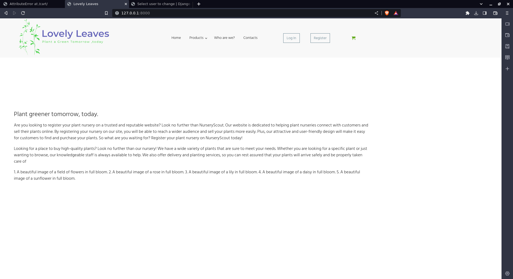
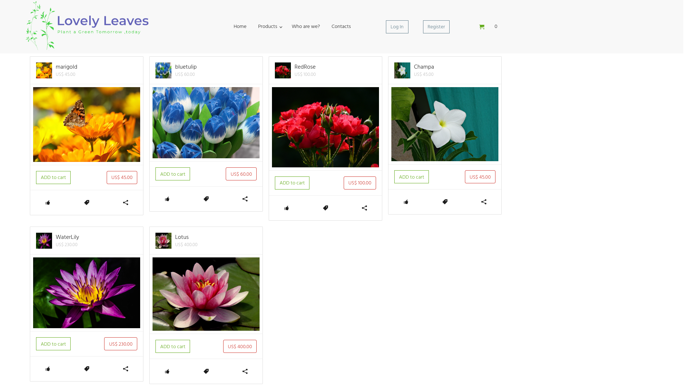
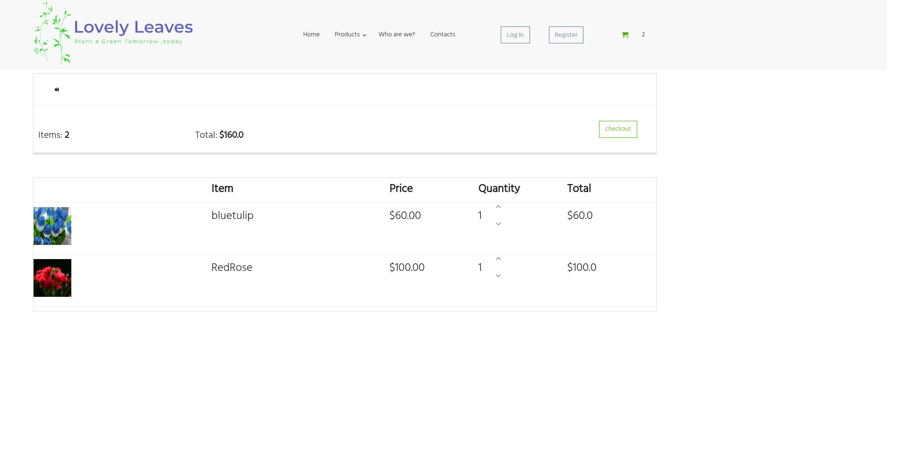
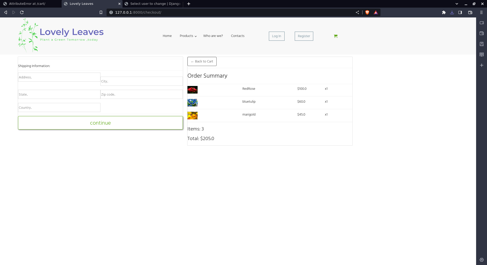

<<<<<<< HEAD
# Simple Ecommerce for plant nursery

## Description
This is a simple website for local plant nursery.

## Setup and Installation
To install all project dependencies, run the following command:

```bash
pipenv install
```

## Activate the Environment

To activate the virtual environment, use the following command:

```bash
pipenv shell
```

## Running the Project
Navigate to the project directory:

```bash
cd simple_ecommerce_website
```

To run the project, execute the following command:

```bash
pipenv run python3 manage.py runserver

```

## Home page



##  Product page



## Cart page



## Shipping and Checkout page


=======
# django-nursery-ecommerece2.0
to install it , make sure you have pipenv installed . 
I have created a virtual environment using pipenv to manage my python django dependencies.

To run it 

The following command will manage all our dependencies
``` pipenv install```

step 2: Activate our environment
```pipenv shell```

step 3: cd  simple_ecomerce_website

```pipenv run python manage.py runserver```


>>>>>>> f900a274a66c843e3a0fa5c949330a5b050ae811

